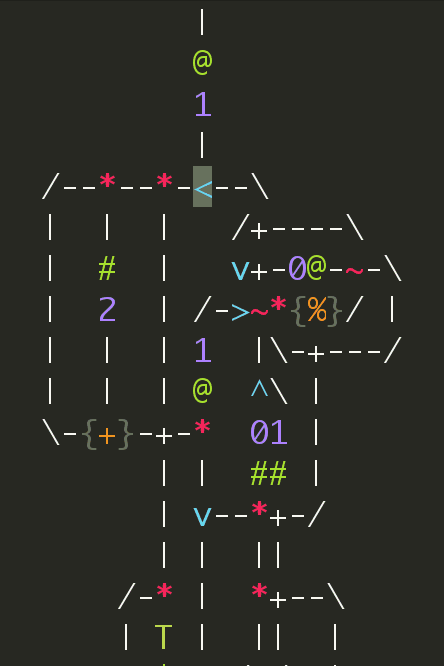

# Debugger for Asciidots

### The Asciidot language
The beautiful [Asciidot language](https://github.com/aaronduino/asciidots) 
develloped by Aaron Janse is inspired by ascii-art and electronic circuits.

You may want to try it online [here](https://asciidots.herokuapp.com/)
or buy cloning the [repo](https://github.com/aaronduino/asciidots).

    git clone https://github.com/aaronduino/asciidots
    cd asciidots
    python __main__.py samples/fibonnacci.dots -d

And you should see the dots in red moving along the lines...
But you will quickly find that you have troubles to understand more complex programs or debug them.

This is where this graphical debugger comes.

### The Graphical Debugger

#### Features
With this, you will be able to:
- play with the time and go back to see where dots comes from
- See the value and id of a dot when you hover it
- Zoom on your code
- Drag your code around in the windows to explore other parts
- But don't get lost in the code because you can reset the view
- Enjoy even more the beauty of ascii-art with nice colors and font
- Don't get distracted with the clean fullscreen

And in the future
- See the values of all dots at the same place
- See all output at the same time
- Edit the code directly in the app
- Give inputs to your code
- Make gifs of your code 

#### Controls

- <kbd>Right</kbd> : Next step
- <kbd>Left</kbd> : Previous step
- <kbd>Ctrl + Right</kbd> : 5th next step
- <kbd>Ctrl + Left</kbd> : 5th previous step
- <kbd>-</kbd> Decrease font size
- <kbd>+</kbd> or <kbd>=</kbd> Increase font size
- <kbd>Ctrl + R</kbd> Reset the view (size and pos)
- <kbd>Escape</kbd> To quit
- Click and drag to move the code

#### Installation and use

The grapical interface is based on pygame, so you need to have it installed.

    pip install pygame

Then in the folder you want:
    
    git clone https://github.com/ddorn/AsciidotsDebugger
    cd AsciidotsDebugger
    python debugger.py samples/fibonnaci.dots

Enjoy it !

### Remarks

This repo is a clone of my own fork of asciidots, this means that there can be a delay (and there will be) 
between an update of the official version of asciidots and the one in this repo.

I'm very open to suggestions, issues and PRs ;)

---

 This work is licensed under a <a rel="license" href="http://creativecommons.org/licenses/by-sa/4.0/">Creative Commons Attribution-ShareAlike 4.0 International License</a>.
